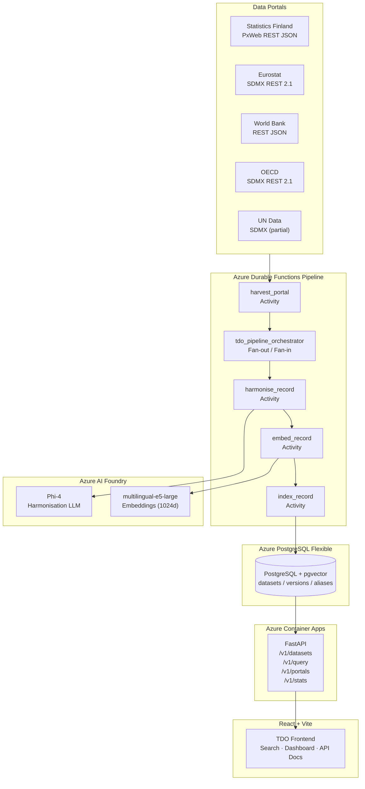

# Trusted Data Observatory (TDO)

A metadata discovery platform that harvests, harmonises, and indexes official statistical datasets from five international portals, making them searchable through a unified REST API and React frontend.

---

## What It Does

- **Harvests** dataset metadata from Statistics Finland, Eurostat, World Bank, OECD, and UN Data
- **Harmonises** raw metadata into a canonical MVM (Minimum Viable Metadata) schema using deterministic mapping tables + Phi-4 LLM fallback
- **Indexes** records with pgvector embeddings (multilingual-e5-large, 1024 dims) for semantic search
- **Serves** a hybrid search API (pgvector cosine + tsvector full-text, RRF fusion) via FastAPI
- **Orchestrates** the harvest → harmonise → embed → index pipeline using Azure Durable Functions

---

## Architecture



---

## Prerequisites

| Tool | Version |
|------|---------|
| Python | 3.12+ |
| Node.js | 18+ |
| Docker & Docker Compose | 24+ |
| Azure CLI | 2.55+ |
| Bicep CLI | latest (`az bicep install`) |

---

## Local Development Setup

### 1. Clone and configure

```bash
git clone <your-repo-url>
cd tdo-platform
cp .env.example .env
# Edit .env with your values
```

### 2. Start services

```bash
docker compose up -d
```

Services started:
- **postgres** on `localhost:5432` (pgvector enabled)
- **embeddings** on `localhost:8080` (multilingual-e5-large via text-embeddings-inference)
- **ollama** on `localhost:11434` (local Phi-4 for harmonisation)
- **minio** on `localhost:9000` (blob storage mock)
- **api** on `localhost:8000` (FastAPI)

### 3. Run database migrations

```bash
python -m alembic upgrade head
```

### 4. Run unit tests

```bash
python -m pytest tests/unit -v
python -m pytest tests/unit --cov=src --cov-report=term-missing
```

### 5. Run the frontend

```bash
cd frontend
npm install
npm run dev        # http://localhost:3000
```

### 6. Trigger a harvest (optional)

```bash
# Harvest one portal manually
python -c "
import asyncio
from src.orchestrator.functions import harvest_portal
asyncio.run(harvest_portal('statistics_finland', 'local-run-001'))
"
```

---

## Azure Deployment

### Prerequisites

1. Azure subscription with **Contributor** and **User Access Administrator** roles on the subscription (or resource group).

   > **Important:** The Bicep templates assign RBAC roles to managed identities (e.g. Key Vault Secrets Officer, ACR Push). This requires the deploying service principal to have **User Access Administrator** (or Owner) on the target scope. Grant it once manually before the first deploy:
   > ```bash
   > az role assignment create \
   >   --assignee <github-sp-object-id> \
   >   --role "User Access Administrator" \
   >   --scope /subscriptions/<subscription-id>
   > ```

2. GitHub repository with OIDC configured:
   ```bash
   az ad app create --display-name tdo-github-oidc
   # Follow: https://docs.github.com/en/actions/security-guides/configuring-openid-connect-in-azure
   ```
3. Set GitHub Actions secrets:
   - `AZURE_CLIENT_ID`
   - `AZURE_TENANT_ID`
   - `AZURE_SUBSCRIPTION_ID`

### Deploy infrastructure

```bash
# Lint Bicep
az bicep lint --file infra/main.bicep

# Preview changes
az deployment sub what-if \
  --location northeurope \
  --template-file infra/main.bicep \
  --parameters infra/parameters/dev.bicepparam

# Deploy
az deployment sub create \
  --location northeurope \
  --template-file infra/main.bicep \
  --parameters infra/parameters/dev.bicepparam
```

Or push to `main` — GitHub Actions will deploy automatically.

### Deploy the application

GitHub Actions (`deploy-app.yml`) triggers after infrastructure is deployed:
1. Builds Docker image
2. Pushes to Azure Container Registry
3. Updates Container Apps revision
4. Smoke-tests `/v1/health`

---

## How to Add a New Portal

1. **Create the adapter** in `src/adapters/<portal_name>.py`:
   ```python
   from src.adapters.base import BasePortalAdapter, RawRecord

   class MyPortalAdapter(BasePortalAdapter):
       portal_id  = "my_portal"
       base_url   = "https://api.myportal.org"
       rate_limit_rps = 1.0

       async def fetch_catalogue(self):
           # yield RawRecord for each dataset
           ...

       async def fetch_record(self, source_id: str) -> RawRecord:
           ...

       def get_portal_defaults(self) -> dict:
           return {
               "_publisher":      "My Portal",
               "_publisher_type": "IO",
               "_access_type":    "open",
               "_license":        "CC-BY 4.0",
               "_source_portal":  self.base_url,
           }
   ```

2. **Add mapping rules** to `src/pipeline/mapping_tables.py`:
   - Add a `MY_PORTAL_TO_MVM` dict mapping source field paths → MVM fields
   - Add schema detection signals to `SCHEMA_DETECTION_SIGNALS`
   - Register in `SCHEMA_TO_MAPPING` and `PORTAL_DEFAULTS`

3. **Register the adapter** in `src/orchestrator/functions.py` `_get_adapter()`:
   ```python
   elif portal_id == "my_portal":
       from src.adapters.my_portal import MyPortalAdapter
       return MyPortalAdapter()
   ```

4. **Write tests** in `tests/unit/test_my_portal_adapter.py` with a JSON/XML cassette.

5. **Add a schedule** in `src/orchestrator/functions.py` `tdo_scheduler()`.

---

## API Reference

Base URL: `https://tdo-api.northeurope.azurecontainer.io`
Authentication: `X-API-Key: <your_key>` header (not required for `/v1/health` and `/v1/stats`)

| Method | Path | Description |
|--------|------|-------------|
| GET | `/v1/datasets` | Search datasets (params: `q`, `geo`, `theme`, `publisher`, `access`, `format`, `min_confidence`, `limit`, `offset`) |
| GET | `/v1/datasets/{id}` | Full MVM record for a specific dataset |
| GET | `/v1/datasets/{id}/similar` | Top-10 semantically similar datasets |
| GET | `/v1/datasets/{id}/provenance` | Field-level provenance and processing record |
| POST | `/v1/query` | Natural language query → structured results + AI summary |
| GET | `/v1/portals` | Portal status, last harvest, record counts |
| GET | `/v1/stats` | Aggregate counts by portal, theme, geography, access type |
| GET | `/v1/health` | Pipeline health check |

### Example requests

```bash
# Search
curl https://tdo-api.northeurope.azurecontainer.io/v1/datasets \
  -H "X-API-Key: your_key" \
  -G \
  --data-urlencode "q=unemployment Finland 2020 onwards" \
  --data-urlencode "access=open" \
  --data-urlencode "min_confidence=0.8"

# Natural language query
curl -X POST https://tdo-api.northeurope.azurecontainer.io/v1/query \
  -H "X-API-Key: your_key" \
  -H "Content-Type: application/json" \
  -d '{"query": "Which datasets cover Nordic unemployment since 1990?"}'

# Health check (no auth)
curl https://tdo-api.northeurope.azurecontainer.io/v1/health
```

---

## Troubleshooting

### `docker compose up` fails — postgres not ready
Wait 10 seconds for postgres to initialise, then retry. Or:
```bash
docker compose restart postgres
```

### Embeddings container OOM
The `multilingual-e5-large` model requires ~2 GB RAM. Increase Docker Desktop memory limit to at least 4 GB.

### `alembic upgrade head` fails — `pgvector` extension not found
```bash
docker compose exec postgres psql -U tdo -c "CREATE EXTENSION IF NOT EXISTS vector;"
```

### API returns 401 for all requests
Set the `TDO_API_KEYS` environment variable:
```bash
export TDO_API_KEYS="dev-key-123,my-other-key"
```
Or add it to `.env`.

### Low confidence scores from harmoniser
If Phi-4 LLM endpoint is not configured, harmonisation runs in deterministic-only mode. Set `PHI4_ENDPOINT` in `.env` to enable LLM enrichment.

### Azure deployment: `BicepLintError`
```bash
az bicep upgrade
az bicep lint --file infra/main.bicep
```

---

## Project Structure

```
tdo-platform/
├── src/
│   ├── adapters/          # Portal-specific harvest adapters
│   ├── api/               # FastAPI endpoints + hybrid search
│   ├── models/            # Pydantic (MVM) and SQLAlchemy models
│   ├── orchestrator/      # Azure Durable Functions pipeline
│   └── pipeline/          # Harmoniser, embedder, indexer, mapping tables
├── infra/
│   ├── main.bicep          # Root Bicep template
│   ├── modules/            # Network, DB, Container Apps, Functions, etc.
│   └── parameters/         # Environment-specific parameter files
├── tests/
│   ├── unit/               # Unit tests (210 tests, 83% coverage)
│   └── integration/        # Full pipeline integration tests
├── frontend/               # React + Vite frontend
├── .github/workflows/      # CI/CD pipelines
├── docker-compose.yml      # Local development
├── docker-compose.test.yml # Integration test environment
└── Dockerfile              # API container image
```
